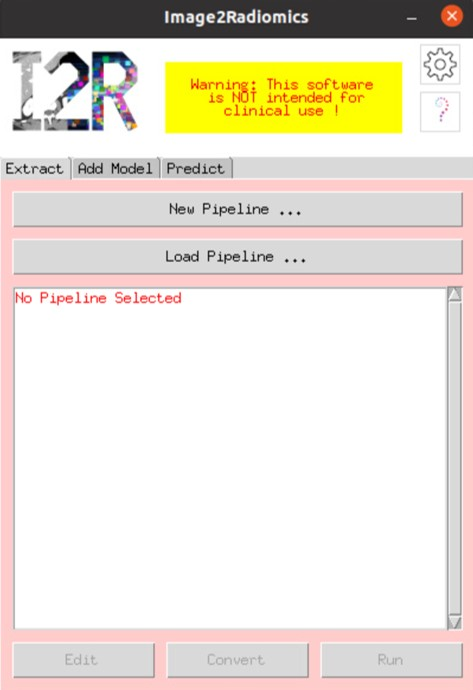
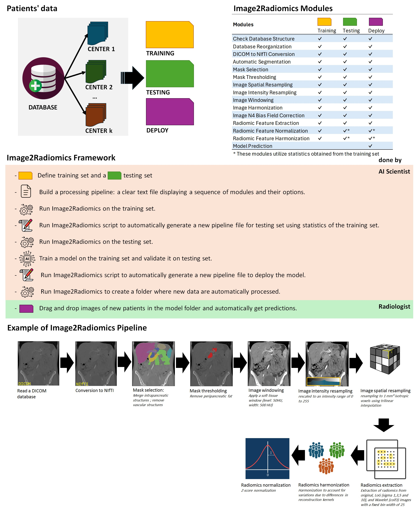

.. Image2Radiomics documentation master file, created by
   sphinx-quickstart on Wed Nov  6 19:46:18 2024.
   You can adapt this file completely to your liking, but it should at least
   contain the root `toctree` directive.

Image2Radiomics documentation!
==============================

This open-source Python package facilitates radiomics feature extraction from medical imaging, focusing on reproducibility across all processing steps before and after radiomics feature extraction. Rather than emphasizing feature extraction alone, this package ensures that every stage of the workflow is consistent and repeatable.

Using a straightforward instruction file, the package allows users to perform a series of operations, including:

- Image conversion (DICOM to NIfTI)
- Image resampling (using `c3d <https://sourceforge.net/projects/c3d/>`_ or `SimpleITK <https://simpleitk.org/>`_)
- Image segmentation (using `TotalSegmentator <https://github.com/wasserth/TotalSegmentator>`_)
- Segmentation selection (by merging or excluding masks from a list)
- Mask thresholding
- Image windowing
- Image harmonization
- Feature normalization
- Feature harmonization (with `ComBAT <https://github.com/Jfortin1/neuroCombat>`_)
- Radiomics feature extraction (using `pyradiomics <https://pyradiomics.readthedocs.io/en/latest/>`_)
- Model evaluation

.. _citation:

Citation
--------

If you use this framework in your research or publications, please cite the following paper:

*Tixier, Florent, et al. "Ensuring Reproducibility and Deploying Models with the Image2Radiomics Framework: An Evaluation of Image Processing on PanNET Model Performance."* *Cancers*, vol. XX, no. XX, 2025, pp. XXX–XXX. DOI: `https://doi.org/10.3390/cancersxxxxxxxx <https://doi.org/10.3390/cancersxxxxxxxx>`_

BibTeX entry:

.. code-block:: bibtex

    @article{tixier2025,
        author  = {Tixier, Florent and Lopez-Ramirez, Felipe and Syailendra, Emir and Blanco, Alejandra and Javed, Ammar A. and Chu, Linda C. and Kawamoto, Satomi and Fishman, Elliot K.},
        title   = {Ensuring Reproducibility and Deploying Models with the Image2Radiomics Framework: An Evaluation of Image Processing on PanNET Model Performance},
        journal = {Cancers},
        year    = {2025},
        volume  = {XX},
        number  = {XX},
        pages   = {XXX--XXX},
        doi     = {10.3390/cancersxxxxxxxx}
    }

.. _coming_soon:

Coming Soon
-----------

A new version of the framework is currently in development and will include:

- A graphical user interface (GUI) for easier use
- Support for saving and reloading processing pipelines in JSON format
- Direct model saving and reuse through the GUI
- And more to come

 
If you’d like to be notified when the new version is released, please fill out this short form:

`Stay updated on new releases <https://forms.office.com/r/5wD34W1sA8>`_

Main Tools
----------

This package includes three primary tools:

1. **`img2radiomics.py`**: Applies a radiomics pipeline to all images in a folder, following specified steps before and after feature extraction. The resulting features are ready for radiomics model building.

2. **`init_auto_folder.py`**: Creates a folder where new data are automatically processed upon file copy, allowing deployment of a model. This tool extracts radiomics features, applies a pre-built model, and generates predictions for new data.

3. **`gen_testing_pipeline_file.py`**: Generates a pipeline file for the testing set or model deployment based on the training set’s pipeline instructions.

Compatibility and Processing
----------------------------

This package is designed for High-Performance Computing (HPC) clusters using SGE or SLURM job schedulers and enables parallel processing of multiple image datasets through a multiprocessing option. Since version 0.8.2, `img2radiomics` can also operate on a Linux computer without a job scheduler. Compatibility with Windows and macOS computers will be available in future versions.

.. note::

   This work was supported by the Lustgarten Foundation

.. warning::

   Not intended for clinical use.

Introduction
------------

*Illustration of the Img2Radiomics framework*

`Img2Radiomics` enables radiomics feature extraction through a standardized, robust pipeline. Patient data in this framework is organized by a unique patient ID (**patientID**) and a sub-analysis identifier (**sub_Analysis**), which allows for separate analyses within a single patient’s data, such as images from different dates, segmentations, or reconstructions.

Data Organization
-----------------

In `Img2Radiomics`, data must be organized by **patientID** and **sub_Analysis**. (Refer to the :py:mod:`CHECK FOLDER module<StructFolderCheck>` for additional details.)

.. warning::

   If only one set of features per patient is needed (i.e., no sub-analysis), a sub-analysis folder is still required. In this case, create a folder named `default` within each patient folder.

Harmonization Requirement
-------------------------

If radiomics features require harmonization, the Excel file containing batch information must include columns named **patientID** and **sub_Analysis**. (See the :py:mod:`FEATURE HARMONIZATION module<feature_harmonization>` for further information.)

.. toctree::
   :hidden:

   Home <self>
   
.. toctree::
    :maxdepth: 2

    installation
    usage
    pipeline
    radiomics

   
Indices and tables
==================

* :ref:`genindex`
* :ref:`modindex`
* :ref:`search`
