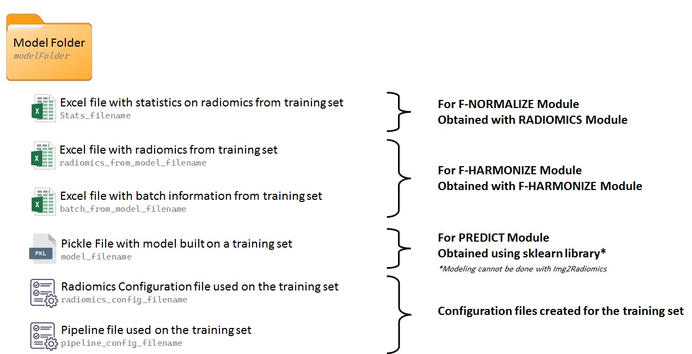

.. _Additional_info:

Additional Information about Modules in the Pipeline File
---------------------------------------------------------

Each module listed above can be included multiple times in the Pipeline file. For example, you could use the :py:mod:`MERGE_MASKS module<NiftiMergeVolumes_multiprocessing>` twice to create different masks (segmentations) for each patient and then use the :py:mod:`RADIOMICS module<radiomics_multiprocessing>` twice to obtain radiomics features for these masks.

Most modules include an option called `input folder`, which specifies the folder where the module will operate. You can also use a period (`.`) instead of specifying an input folder. In this case, the input folder must be provided with the `-i` flag of the `img2radiomics` program. Additionally, you can set the `input folder` option to `PREVIOUS_BLOCK_OUTPUT_FOLDER` to use the output from the previous module as the input for the current module.

For training data, it is recommended to configure the pipeline file to generate a model folder containing the necessary information for applying the same processing steps to testing datasets or prospectively collected data. The figure below illustrates the information that should be included in the model folder.

